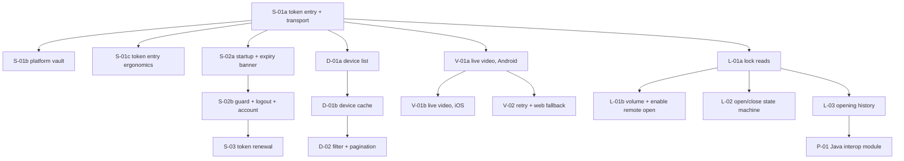

# Slices — Case Mibo Smart

Canonical, offline source for the orchestrator (`wave-orchestrate`, `issuesPath: docs/specs/issues.md`).
Derived from `docs/specs/SPEC.md` v0.1. Criteria are **referenced by SPEC ID**, never copied — the SPEC
stays the source of truth for behaviour, `docs/adr/` for structure, `docs/api-contract.md` for the wire.

Wave 0 (walking skeleton) was delivered as chores, not slices: #6 docs, #7 KMP skeleton + CI,
#8 `:konture-test`. It is not re-emitted here. Chore #9 (ADR-005 player checkpoint) is referenced by
`V-01`, not duplicated.

Waves below are **derived from `Depends on:`**, not assigned. The orchestrator recomputes the graph in
code and the numbers here are advisory.

## Slice dependency graph



---

## Wave 1

### [S-01a] Validate an access token and enter the app
- **Problem:** there is no way into the app. Nothing reaches the partner API yet: no HTTP client, no
  envelope reader and no typed errors. Every later slice needs all three, and `docs/PROCESS.md` §2 is
  explicit that the first functional slice builds them out of its own need rather than as a foundation
  ticket.
- **Scope:** token entry screen with its three states; one-call validation through
  `listar-dispositivos` (`tamanhoPagina: 1, pagina: 1`); envelope reader for both response shapes;
  typed domain errors; the Ktor client with the host read from `BuildConfig` and `Authorization`
  sanitised in the log; a `SessionStore` interface in `commonMain` with an in-memory implementation.
- **Non-goals:** the platform vault — Keystore / Keychain `expect/actual` — which is **S-01b**; the
  token surviving process death (S-01b); startup routing, expiry banner, expiry guard, logout and the
  account screen (S-02); renewal (S-03); the real device list, its cache or SQLDelight (D-01) —
  validation inspects success/failure and discards the payload; any camera or lock code; the exhaustive
  E2 error taxonomy and the wrapped-404 → device-not-found mapping, which belong to D-01 (no 404 is
  reachable until a device is addressed); the ADR-006 request counter, which belongs to S-02.
  **No error category, DTO field or HTTP-client capability may be added unless a test named in this
  ticket proves it** — speculative generality is what made the first version of this slice unreviewable.
- **Expected behaviour:** cold start shows a masked token field with a paste action and "Validar"
  disabled while the input is blank. Submitting shows a spinner, locks the input and makes exactly one
  API call. On success the token goes into the `SessionStore` and a one-shot event navigates to a
  **placeholder device-list destination** — the real list is D-01's, so the test asserts the emitted
  event, not a rendered list. A rejected token keeps the user on the screen with "Token inválido ou
  expirado" and stores nothing. A network failure shows "Sem conexão" with a retry and keeps what was
  typed.
- **Technical detail:** HTTP status is always 200 and errors arrive in the body; both envelope shapes
  (`{statusCode, body}` and flat `{status, msg}`) must parse — `docs/api-contract.md` §1.1. A flat
  `status: "erro"` whose `msg` starts with "Erro desconhecido" on a well-formed request means
  token-rejected (§1.2, ADR-002). Host comes from `local.properties` (`smarthome.apiHost`) through
  `BuildConfig`; it is never written into a versioned file. Ktor `Logging` uses `LogLevel.HEADERS` with
  the `Authorization` header redacted (ADR-008) — never `LogLevel.ALL`. Every `catch (Throwable)`
  rethrows `CancellationException` first. `SessionStore` is a plain `commonMain` interface so both
  targets link without an `expect/actual`; S-01b swaps the implementation behind it.
  **Error taxonomy is limited to the four categories this slice can actually observe**: token-rejected,
  offline/no-network, unexpected-response (malformed JSON or missing `data`), and a generic API-error
  fallback carrying the server `msg`. The remaining E2 categories — device-not-found, quota-exceeded,
  operation-rejected — are added by the first slice that can receive them (D-01, V-01, L-01). Model the
  sealed hierarchy so those arrive as new subtypes, not as a refactor.
  **Dark previews are one `uiMode`-parameterised preview function, not a second set of screen bodies.**
- **Size (estimate, not a stop instruction — ADR-017):** ~3 points, calibrated as a **feature screen**: ≈400 executable production lines + ≈350 test. Measure with `python tools/executable-lines.py <base>..<head>` and put both numbers in the PR body. Return `blocked` only if the extra work comes from **scope this ticket does not name** — an overrun inside the named scope is an estimation defect, not a reason to discard working code.
- **Files:** `shared/domain/src/commonMain/kotlin/io/github/npauloj/mibosmart/domain/session/`
  (Token, SessionStore interface), `.../domain/error/` (typed errors per ADR-002);
  `shared/data/src/commonMain/kotlin/io/github/npauloj/mibosmart/data/remote/` (HttpClientFactory,
  LogSanitizer, EnvelopeReader, SmartHomeApi, DTOs with `@SerialName`),
  `.../data/session/InMemorySessionStore.kt`;
  `shared/app/src/commonMain/kotlin/io/github/npauloj/mibosmart/app/session/` (AuthenticateToken,
  TokenEntryViewModel, TokenScreen, TokenScreenContent + `PreviewParameterProvider`),
  `.../app/di/AppModules.kt`, `shared/app/src/commonMain/composeResources/values/strings.xml`,
  `androidApp/build.gradle.kts` (BuildConfig field), `local.properties.example`.
- **Depends on:** none
- **Issue:** #14
- **Acceptance criteria (EARS):** SPEC **S1, S3, S4**, **E1, E3, E4**, plus the logging half of **S9**.
  **S2 is split**: the "one validation call and navigate" half is proven here, the "persist in secure
  storage" half is S-01b's. **E2 is partial**: only the four categories above; the exhaustive taxonomy
  is D-01's. Implement the SPEC's test names verbatim:
  `TokenEntryViewModelTest.emptyInputKeepsSubmitDisabled`,
  `AuthenticateTokenTest.validTokenIsStoredAndSucceeds` (fake repository counts exactly one call;
  asserts the store received the token and the navigation event was emitted) / `.rejectedTokenIsNotStored`
  / `.networkFailureKeepsInput`, `EnvelopeReaderTest.wrappedSuccess` / `.flatSuccess`
  / `.flatErrorMissingToken` / `.flatErrorUnknownBecomesTokenRejected` / `.malformedJsonIsUnexpectedResponse`,
  `UseCaseCancellationTest.propagates`, `LogSanitizerTest.authorizationHeaderRedacted`.
  Previews: the four of SPEC §1 "Visual acceptance" — `TokenScreen_Idle`, `TokenScreen_Typing`,
  `TokenScreen_Validating`, `TokenScreen_Error` — each rendering its dark variant through the same
  `uiMode`-parameterised function; rule 11 fails the build without them.
- **Test scenarios:** valid token stored in memory and event emitted; rejected token not stored, input
  kept; network failure keeps input and offers retry; malformed JSON becomes "Resposta inesperada";
  cancellation propagates instead of being mapped to an error.
- **Rollout / kill switch:** n/a — nothing is written to disk in this slice; the in-memory store dies
  with the process.
- **Events / metrics:** n/a — this slice has no surface that shows them. The ADR-006 request counter
  is S-02's, together with the account screen that displays it.
- **i18n / LGPD / factories:** all strings in Compose resources, pt-BR default with en fallback (E6).
  The token is a credential — never logged, never in a crash message, never in a versioned file (ADR-008).
- **Applies to / ADRs:** commonMain only — no `expect/actual`, so both targets link. Implements
  ADR-001, ADR-002; ADR-008's logging half.

---

## Wave 2

### [S-01b] Persist the session in the platform vault  [P]
- **Problem:** the validated token lives in `InMemorySessionStore`, so it dies with the process and the
  user re-types it on every cold start. ADR-008 requires the credential to sit in the platform's secure
  storage, and S-02a cannot route from a stored session until one survives.
- **Scope:** the `SecureTokenStore` `expect` with both actuals (Android Keystore, iOS Keychain), a
  `VaultSessionStore` that implements the existing `SessionStore` interface on top of it, and the
  one-line DI binding swap.
- **Non-goals:** any change to the token screen, the envelope reader, the typed errors or the HTTP
  client; startup routing, the expiry guard, logout and the account screen (S-02a/S-02b); renewal
  (S-03); widening `SessionStore` with `issuedAt` or `clear()` — ADR-010 assigns that to the slice that
  has a caller for them. This slice changes **where** the token lives, not what the app does with it.
- **Expected behaviour:** a token validated before the app is killed is still there when it starts
  again. Nothing the user sees changes: same screen, same states, same flow.
- **Technical detail:** the `expect` lives in `:shared:data` under a package named `platform`
  (rule 8, ADR-001/008) — never in `:androidApp`/`iosApp`. Android: AES/GCM key in `AndroidKeyStore`
  with ciphertext + IV in a private `SharedPreferences`; iOS: `kSecClassGenericPassword` with
  `kSecAttrAccessibleAfterFirstUnlockThisDeviceOnly` via the `Security` cinterop. Writing an existing
  key overwrites it; reading an absent key returns null rather than throwing.
  **`AppModules.kt` changes by one binding line — do not reformat or re-order the rest**, because
  S-01b, S-02a, D-01a, V-01a and L-01a all touch that file in this wave.
- **Files:** `shared/data/src/commonMain/kotlin/io/github/npauloj/mibosmart/data/platform/vault/SecureTokenStore.kt`
  (expect), `shared/data/src/androidMain/kotlin/.../data/platform/vault/SecureTokenStore.android.kt`,
  `shared/data/src/iosMain/kotlin/.../data/platform/vault/SecureTokenStore.ios.kt`,
  `shared/data/src/commonMain/kotlin/.../data/session/VaultSessionStore.kt`,
  `shared/data/src/commonTest/kotlin/.../data/session/VaultSessionStoreTest.kt`,
  `shared/data/src/commonTest/kotlin/.../data/session/FakeSecureTokenStore.kt`,
  `shared/data/src/commonMain/kotlin/.../data/di/DataModule.kt` (binding only).
- **Depends on:** S-01a
- **Issue:** #25
- **Size (estimate, not a stop instruction — ADR-017):** ~2 points, calibrated as a **narrow slice**: ≈120 executable production lines + ≈100 test. Measure with `python tools/executable-lines.py <base>..<head>` and put both numbers in the PR body. Return `blocked` only if the extra work comes from **scope this ticket does not name** — an overrun inside the named scope is an estimation defect, not a reason to discard working code.
- **Acceptance criteria (EARS):** the persistence half of SPEC **S2** and the storage half of **S9**.
  **Every criterion below is provable by `./gradlew :shared:data:testAndroidHostTest`** — the Keystore
  and Keychain actuals cannot run there (no Robolectric, no instrumented source set, and the macOS CI
  job does not run on PRs), so the platform proof is the manual step named under "Evidence", exactly as
  ADR-008 §Confirmation already prescribes. **Do not add a test dependency to change this**; if you
  believe one is required, return blocked and say which.
  - WHEN a token is written and read back, THE SYSTEM SHALL return the same token
    _(test: `VaultSessionStoreTest.roundTripsToken`, against `FakeSecureTokenStore`)_
  - WHEN a token is written over an existing one, THE SYSTEM SHALL keep only the newer value
    _(test: `VaultSessionStoreTest.overwriteKeepsLatest`)_
  - IF nothing was ever stored, THE SYSTEM SHALL return null instead of throwing
    _(test: `VaultSessionStoreTest.absentKeyReturnsNull`)_
  - IF the platform store throws while reading, THE SYSTEM SHALL surface no session rather than crash
    the app _(test: `VaultSessionStoreTest.readFailureIsTreatedAsNoSession`)_
  - THE SYSTEM SHALL keep every S-01a behaviour green behind the new implementation
    _(test: the existing `AuthenticateTokenTest` suite, unchanged, with `VaultSessionStore` bound)_
- **Test scenarios:** round trip; overwrite; absent key; the platform store throwing; S-01a's suite
  still green.
- **Evidence — manual, named, and required in the PR body (ADR-008 §Confirmation):**
  1. validate a token, force-stop the app, cold start → the app does **not** ask for the token again;
  2. `adb shell run-as io.github.npauloj.mibosmart cat shared_prefs/*.xml` → the token does not appear
     in plaintext;
  3. state plainly that the **iOS Keychain actual was not executed** — the macOS job does not run on
     PRs. Claiming otherwise is the failure mode this line exists to prevent.
- **Rollout / kill switch:** the `SessionStore` interface is the switch — reverting the one binding
  line restores the in-memory behaviour without touching any other code.
- **Events / metrics:** n/a — no API calls.
- **i18n / LGPD / factories:** the token never leaves the vault except as the `Authorization` header and
  its last 4 characters (ADR-008).
- **Applies to / ADRs:** androidMain + iosMain (`expect/actual`). Implements ADR-008, follows ADR-010;
  rule 8 covers the `platform` package.

### [S-02a] Start the app from a stored session and warn before it expires
- **Problem:** S-01b will make the token survive a restart, but nothing reads it back: the app still
  opens on the token screen every cold start, and a session that is about to die gives no warning.
- **Scope:** startup routing from the stored session; the session clock and expiry policy in the
  domain; the "Token expira em breve" banner on the device-list destination.
- **Non-goals:** `SessionStore.clear()` — S-02b adds it with the logout that calls it; the token-identity
  session guard, logout and the account screen — those are **S-02b**;
  renewal (S-03); the real device list, its cache or its requests (D-01a/D-01b) — this slice routes to
  the **placeholder** destination S-01a created and does not render devices; any change to the vault
  (S-01b) or to the token screen.
- **Expected behaviour:** a cold start with a stored session opens the device-list destination directly,
  with **no validation call**. A cold start without one opens the token screen, as today. Once the
  session passes 1 h 50 min, a non-blocking banner appears on the device-list destination; it never
  blocks interaction and has no action of its own yet.
- **Technical detail:** the expiry clock is an injected `Clock` port in `:shared:domain` so tests use
  virtual time; expiry counts from the first successful validation (`[ASSUMED]`, SPEC S7). **No API
  call on a timer** (SPEC E5). The destination is the constant `AppDestination.DeviceList` that S-01a
  already navigates to — **use that constant, do not introduce a second route name**; D-01a replaces
  what it renders, not its name.

  **This slice owns the `SessionStore` widening, and this is its final shape — write exactly this:**

  ```kotlin
  interface SessionStore {
      /** The current session, or `null` when there is none. */
      suspend fun read(): Session?
      /** Stores [token] as the session's credential, replacing any previous one. */
      suspend fun write(token: Token, issuedAt: Instant)
  }

  /** A stored session: the credential and when it started counting down (SPEC S7). */
  data class Session(val token: Token, val issuedAt: Instant)
  ```

  `clear()` is **not** added here — S-02b adds it, in the slice that has a logout to call it. The two
  implementations that must follow: `InMemorySessionStore` (S-01a) and `VaultSessionStore` (S-01b, PR
  #37) — the latter persists `issuedAt` alongside the token through `SecureTokenStore`, whose shape
  after #37 is `internal interface SecureTokenStore { fun read(): String?; fun write(token: String) }`
  with `internal expect fun Scope.secureTokenStore(): SecureTokenStore`. Widen that too if you need a
  second value, or encode both into the one stored string — **your call, but state which in the PR.**
  The fake used by `SessionStartTest` is this slice's to write.
- **Files:** `shared/domain/src/commonMain/kotlin/.../domain/session/Session.kt` (SessionState, expiry
  policy, `Clock` port, `issuedAt` on the store),
  `shared/app/src/commonMain/kotlin/.../app/session/SessionStartup.kt`,
  `shared/app/src/commonMain/kotlin/.../app/AppViewModel.kt` (extend: route from the stored session),
  `shared/app/src/commonMain/kotlin/.../app/App.kt` (banner slot on the placeholder destination only),
  `shared/app/src/commonMain/kotlin/.../app/di/AppModules.kt` (registrations only),
  `shared/app/src/commonMain/composeResources/values/strings.xml` and `values-en/strings.xml`,
  `shared/app/src/commonTest/kotlin/.../app/session/SessionStartTest.kt`,
  `shared/app/src/commonTest/kotlin/.../app/session/SessionStateTest.kt`.
- **Depends on:** S-01b
- **Issue:** #15
- **Size (estimate, not a stop instruction — ADR-017):** ~2 points, calibrated as a **narrow slice**: ≈120 executable production lines + ≈100 test. Measure with `python tools/executable-lines.py <base>..<head>` and put both numbers in the PR body. Return `blocked` only if the extra work comes from **scope this ticket does not name** — an overrun inside the named scope is an estimation defect, not a reason to discard working code.
- **Acceptance criteria (EARS):** SPEC **S5** and **S7**.
  - `SessionStartTest.storedTokenSkipsEntry` — a stored session opens the device-list destination and
    the fake repository's call counter stays at **0**
  - `SessionStartTest.noStoredTokenOpensTokenScreen`
  - `SessionStateTest.warnsBeforeExpiry` — on a fake clock, the banner appears at 1 h 50 min and not before
  - `SessionStateTest.freshSessionShowsNoBanner`
  Preview: the placeholder destination with and without the banner, dark variant through the same
  `uiMode`-parameterised function.
- **Test scenarios:** stored session skips entry with zero calls; no session opens the token screen;
  the banner at exactly 1 h 50 min on virtual time; a fresh session with no banner.
- **Rollout / kill switch:** n/a — routing only, fails safe towards the token screen.
- **Events / metrics:** n/a — the ADR-006 counter is S-02b's, with the account screen that shows it.
- **i18n / LGPD / factories:** banner text in Compose resources, pt-BR default with en fallback (E6).
- **Applies to / ADRs:** commonMain. ADR-003 (one state per screen), ADR-010 (`SessionStore` widens
  here), ADR-006 (no polling).

### [S-02b] Clear an expired session, log out, and show the account screen
- **Problem:** when the partner rejects a request mid-session the app has nowhere to put that fact: the
  user stays on a screen backed by a dead token, with no way out and no way to see what is going on.
- **Scope:** the session guard that clears the stored session on 401/403 and routes back with a reason
  and a return destination; "Sair"; the account screen with token suffix, expiry and the ADR-006
  request counter in debug builds.
- **Non-goals:** renewal (S-03); startup routing and the expiry banner (S-02a); the real device list
  (D-01a); any change to the vault (S-01b) or to the envelope reader and error taxonomy, which are
  already correct after ADR-012.
- **Expected behaviour:** when any use case is refused for a request sent with the **currently stored**
  token, the session is cleared and the user returns to the token screen — with the partner's own
  sentence on a 403 and "Sua sessão expirou (tokens valem 2 h)" otherwise — and after re-validating,
  the app returns to the screen they were on. A refusal carrying a token that has since been replaced
  is dropped and the stored session is left alone. "Sair" clears the session and returns to the token
  screen. The account screen shows only the last 4 characters of the token.
- **Technical detail:** the guard compares **token identity**, never timestamps: every failure carries
  the token its request was sent with, so a renewal completing while an old request is in flight cannot
  wipe the new session (SPEC S6). Both `TokenRejected` (401) and `TokenExpired` (403) trigger it, and
  the 403's `serverMessage` is shown as-is — the one category SPEC U6 allows quoting (ADR-012). The
  return destination travels with the refusal (U5).
- **Files:** `shared/domain/src/commonMain/kotlin/.../domain/session/SessionGuard.kt`,
  `shared/data/src/commonMain/kotlin/.../data/session/` (carry the request's token on failure),
  `shared/data/src/commonMain/kotlin/.../data/remote/RequestCounter.kt` (increment per API call),
  `shared/app/src/commonMain/kotlin/.../app/session/Logout.kt`,
  `shared/app/src/commonMain/kotlin/.../app/session/AccountViewModel.kt`,
  `shared/app/src/commonMain/kotlin/.../app/session/AccountScreen.kt` + `AccountScreenPreviews.kt`,
  `shared/app/src/commonMain/kotlin/.../app/App.kt` (account route only),
  `.../app/di/AppModules.kt`, both `strings.xml`.
- **Depends on:** S-02a
- **Issue:** #32
- **Size (estimate, not a stop instruction — ADR-017):** ~3 points, calibrated as a **feature screen**: ≈400 executable production lines + ≈350 test. Measure with `python tools/executable-lines.py <base>..<head>` and put both numbers in the PR body. Return `blocked` only if the extra work comes from **scope this ticket does not name** — an overrun inside the named scope is an estimation defect, not a reason to discard working code.
- **Acceptance criteria (EARS):** SPEC **S6**, **S8**, the UI half of **S9**, and **U5**.
  - `SessionGuardTest.rejectionClearsAndRoutes` (401) and `.expiryClearsAndRoutesWithServerMessage` (403)
  - `SessionGuardTest.rejectionOfRotatedTokenDoesNotClearVault` — a refusal carrying a replaced token
  - `SessionGuardTest.rejectionCarriesReasonAndReturnDestination`
  - `LogoutTest.clearsSecureStore`
  - `AccountViewModelTest.exposesSuffixOnly` — never more than the last 4 characters
  - `AccountViewModelTest.showsRequestCount` — the ADR-006 counter in debug builds
  Previews: `AccountScreen_Valid`, `_ExpiringSoon`, `_Expired`, each with its dark variant through the
  same `uiMode`-parameterised function.
- **Test scenarios:** 401 clears and routes; 403 clears and shows the server's sentence; a refusal of a
  rotated token changes nothing; logout empties the store and a following cold start asks for a token;
  the suffix is the only fragment rendered.
- **Rollout / kill switch:** n/a — the guard fails safe: clearing a session only ever sends the user to
  the entry screen.
- **Events / metrics:** this slice **owns** the ADR-006 request counter end to end — the increment in
  the HTTP layer and the debug surface that displays it.
- **i18n / LGPD / factories:** strings in Compose resources; the token suffix is the only fragment ever
  rendered (ADR-008).
- **Applies to / ADRs:** commonMain. ADR-003, ADR-008, ADR-012 (both statuses trigger the guard).
  Navigation events are a one-shot `SharedFlow` — Turbine is allowed there and only there (`CLAUDE.md`).

### [D-01a] List the account's devices, classified and ordered  [P]
- **Problem:** the app authenticates and then shows a placeholder. The device list is the hub every
  other feature is reached from, and it is also the first slice that can receive a device-not-found
  error — the taxonomy S-01a deliberately left incomplete.
- **Scope:** page 1 of `listar-dispositivos` (`tamanhoPagina: 20`, `origem: todos`); classification from
  `modelo`; row rendering with online/offline, origin badge, parent hub and "visto pela última vez há
  X"; deterministic ordering; loading / success / empty / error states with previews; completing the E2
  taxonomy with device-not-found.
- **Non-goals:** **all persistence** — the SQLDelight cache, its driver and the stale/offline banner are
  **D-01b**, and nothing in this slice writes to disk; the origin filter's *behaviour*, next-page
  loading and single-flight serialisation (D-02) — the chips render but selecting one is D-02's
  criterion; pull-to-refresh (D-02); `funcoes` calls (V-01a owns the capability check); the live-video
  and lock screens.
- **Expected behaviour:** opening the list requests page 1 exactly once and renders the rows ordered as
  online cameras and locks, then other online devices, then offline devices, each group by name. An
  empty first page shows "Nenhum dispositivo para este filtro" with the chips still visible. A network
  failure shows the error state with retry — **without a cache there is nothing else to show yet**. A
  401/403 defers to the S-02b guard.
- **Technical detail:** classification uses `modelo` only, with no extra call at list time — `iM*` →
  Camera, `*MFR*` with a sub-device → Lock, `IOT-ZG2-IB` → Hub (`docs/api-contract.md` §4). Offline rows
  carry `ultimaVezOnline`; absent means "nunca visto online" (U3). A wrapped envelope with
  `statusCode: 404` and "Dispositivo não encontrado" is the **first** reachable device-not-found, so it
  joins `SmartHomeException` as a new subtype — not a refactor (ADR-002, ADR-012). **Never write a real
  device serial or `idProduto` into a versioned file**: fixtures use placeholders.
- **Files:** `shared/domain/.../domain/device/Device.kt` (extend), `.../domain/device/DeviceClassifier.kt`,
  `.../domain/device/DeviceOrdering.kt`, `.../domain/error/SmartHomeException.kt` (DeviceNotFound);
  `shared/data/.../data/remote/` (listar-dispositivos request + DTOs, 404 mapping);
  `shared/app/.../app/devices/` (ListDevices, DeviceListViewModel, DeviceUiMapper, DeviceListScreen,
  DeviceListScreenPreviews + `PreviewFixtures`), `.../app/App.kt` (the device-list destination replaces
  the placeholder — **keep the route constant S-01a defined**), `.../app/di/AppModules.kt`, both
  `strings.xml`.
- **Depends on:** S-01a
- **Issue:** #16
- **Size (estimate, not a stop instruction — ADR-017):** ~3 points, calibrated as a **feature screen**: ≈400 executable production lines + ≈350 test. Measure with `python tools/executable-lines.py <base>..<head>` and put both numbers in the PR body. Return `blocked` only if the extra work comes from **scope this ticket does not name** — an overrun inside the named scope is an estimation defect, not a reason to discard working code.
- **Acceptance criteria (EARS):** SPEC **D1, D3, D5, D6**, **U3**, **U8**, **D9** (defers to the guard),
  and **E2 completed** with device-not-found. Tests: `ListDevicesTest.firstPageUsesDefaults` (exact
  request via `MockEngine`), `.emptyFirstPageIsEmptyState`, `.networkFailureShowsError`,
  `EnvelopeReaderTest.wrappedError404IsDeviceNotFound`, `ErrorMappingTest.exhaustive`,
  `DeviceClassifierTest.classifiesTestAccountInventory`, `DeviceUiMapperTest.subdeviceShowsParent` /
  `.offlineRowShowsLastSeen` / `.offlineWithoutTimestampSaysNever`,
  `DeviceOrderingTest.onlineActionableFirstThenByName`.
  Previews: `DeviceListScreen_Loading`, `_Success`, `_Empty`, `_Error`, each with its dark variant
  through the same `uiMode`-parameterised function; the provider includes a very long name, an old
  `ultimaVezOnline` and 20 rows.
- **Test scenarios:** exact request asserted; empty page 1; network failure; a sub-device showing its
  parent hub; ordering across mixed online/offline; a wrapped 404 becoming device-not-found rather than
  a token error.
- **Rollout / kill switch:** n/a — read-only, no persistence, no new dependency.
- **Events / metrics:** one counter increment per list request (the counter itself is S-02b's).
- **i18n / LGPD / factories:** strings in Compose resources; `PreviewFixtures` use **placeholder**
  serials, never the test account's.
- **Applies to / ADRs:** commonMain. ADR-002, ADR-003, ADR-004, ADR-006 (one request per entry).

### [D-01b] Cache the device list so a cold start costs nothing
- **Problem:** D-01a calls the API on every entry. The account has ~300 requests for the whole case
  (ADR-006), and an offline user sees an error where the app could show what it already knows.
- **Scope:** the SQLDelight schema and its driver `expect/actual`, `DeviceCache` with a timestamp,
  writing each successful page, the stale/offline state with "Sem conexão — última atualização há N
  min", and a schema version with an explicit mismatch rule.
- **Non-goals:** any change to classification, ordering, row layout or the request of D-01a; the filter
  and pagination (D-02); caching anything other than the device list.
- **Expected behaviour:** a successful page is written to the cache with its timestamp. A network
  failure **with** a cache shows the cached rows plus a banner saying how old they are, and a retry;
  **without** a cache it shows D-01a's error state. A cold start renders the cache before any network
  result.
- **Technical detail:** SQLDelight is already pinned in `gradle/libs.versions.toml` and sanctioned by
  ADR-006, so applying the plugin to `:shared:data` needs no new ADR — **adding any other dependency
  does**. The driver `expect/actual` lives under `data/platform/` (rule 8); `sqldelight-sqlite-driver`
  is in the catalog, so the cache test runs on the JVM host.
  **The schema carries a version constant, and a mismatch drops the table and refetches** — without
  that rule, D-02 extending the row shape either crashes on an old cache or serves rows of the wrong
  shape. That rule has its own test; it is not optional.
- **Files:** `shared/data/src/commonMain/sqldelight/.../Device.sq`,
  `shared/data/.../data/local/DeviceCache.kt`, `.../data/local/SchemaVersion.kt`,
  `shared/data/.../data/platform/db/DatabaseDriverFactory.kt` (expect) + `androidMain`/`iosMain` actuals,
  `shared/data/build.gradle.kts` (SQLDelight plugin), `.../data/di/DataModule.kt`,
  `shared/app/.../app/devices/DeviceListViewModel.kt` (stale state), `DeviceListScreenPreviews.kt`
  (`_Stale`), both `strings.xml`.
- **Depends on:** D-01a
- **Issue:** #33
- **Size (estimate, not a stop instruction — ADR-017):** ~2 points, calibrated as a **narrow slice**: ≈120 executable production lines + ≈100 test. Measure with `python tools/executable-lines.py <base>..<head>` and put both numbers in the PR body. Return `blocked` only if the extra work comes from **scope this ticket does not name** — an overrun inside the named scope is an estimation defect, not a reason to discard working code.
- **Acceptance criteria (EARS):** SPEC **D8**, **D10**, and **U2** (cache rendered before the network).
  - `DeviceCacheTest.roundTripsPage`
  - `DeviceCacheTest.schemaVersionMismatchDropsAndRefetches` — the rule above, proven
  - `ListDevicesTest.offlineWithCacheShowsStale` / `.offlineWithoutCacheShowsError`
  - `SessionStartTest.cachedListRenderedBeforeNetwork` — state asserted before the fake repository answers
  Preview: `DeviceListScreen_Stale` + dark variant.
- **Test scenarios:** round trip; a version bump dropping the table; offline with and without a cache;
  the cache rendering before the network answers.
- **Rollout / kill switch:** the version constant **is** the kill switch — bumping it discards every
  cached row on next launch. Reinstalling the app clears it entirely.
- **Events / metrics:** the stale banner's age is the user-visible proof the cache works.
- **i18n / LGPD / factories:** banner text in Compose resources; cached rows hold no credential.
- **Applies to / ADRs:** commonMain + `expect/actual` driver under `data/platform/`. Implements ADR-006;
  rule 8 covers the driver.

### [V-01a] Watch a camera live on Android: capability, session, player and teardown  [P]
- **Problem:** live video is the most-cited failure in the partner's real user reviews and the case's
  highest-risk requirement. It also spends streaming quota, so a session left open costs the account.
- **Scope:** the `funcoes` capability check cached per camera per install; session creation with the
  documented body; handing `data.url` to the player inside the 15-second expiry window; the loading
  overlay with a named step; quota-exceeded and offline states; teardown on back, on `ON_STOP` and on
  mid-creation cancellation; the **Android** Media3 actual.
- **Non-goals:** the **real** iOS player and the ADR-005 checkpoint — those are **V-01b**. This slice
  ships an `iosMain` **placeholder actual** (see Technical detail): an `expect` without an `actual` for
  a declared target does not compile, and because the macOS job does not run on pull requests it would
  merge green and break `main`. The retry policy,
  the first-frame timeout and the web fallback (V-02); recordings, PTZ, two-way audio, snapshots,
  multi-camera grid; changing the device list.
  **No test may issue a real `criar-fluxo-video`, `funcoes` or `encerrar-sessao` call** — all three are
  exercised through `MockEngine` only. The account's streaming quota is shared and finite.
- **Expected behaviour:** opening a camera checks capability at most once per camera per install and,
  without `RTSV`, says "Esta câmera não anuncia vídeo ao vivo" without creating a session. Otherwise a
  session is created and the player prepared in the same coroutine, before any other suspension. While
  creating or reconnecting the screen shows the current step **in words** — never a percentage, never an
  unbounded spinner. Quota exhaustion shows "Cota de streaming esgotada" with no retry; an offline
  camera shows "Câmera offline" and creates nothing. Leaving, backgrounding or cancelling mid-creation
  detaches the player and calls `encerrar-sessao` for the active `session_id`.
- **Technical detail:** create with `stream_gb: 0.5`, `streamId: 1`, `canalVideo: 0`
  (`docs/api-contract.md` §6); `data.url` expires in 15 s. Teardown runs from the **app-level
  `SupervisorJob` scope under `NonCancellable`** with a 5 s timeout — never from `viewModelScope`, which
  is already cancelled when the ViewModel is cleared (SPEC V8). `ON_STOP` is observed by the screen
  through `LifecycleEventEffect` calling `viewModel.stop()`. The player is an
  `expect @Composable LiveVideoPlayer` in `app.camera.platform` (rule 8, ADR-005). **Both actuals ship
  here**: the Android one is the real Media3 player; the iOS one is a placeholder composable that
  renders "Vídeo ao vivo chega na próxima entrega" and **creates no session**. V-01b replaces that
  placeholder with the WKWebView — it does not introduce the declaration.

  **Before opening the PR, `./gradlew :shared:app:compileKotlinIosSimulatorArm64
  -Pkotlin.native.enableKlibsCrossCompilation=true -Pkotlin.native.ignoreDisabledTargets=false` must
  pass, and its output goes in the PR body.** It cross-compiles Kotlin/Native from Windows, so an iOS
  `expect/actual` is verified before merge instead of after — the S-01b worker proved this works on
  this machine (PR #37). Without it, the only iOS check is the macOS CI job, which does not run on PRs.
  **Media3 goes in `shared/app/build.gradle.kts` under `androidMain.dependencies`** — the actual lives
  in `:shared:app/androidMain`, and `:androidApp` depends on `:shared:app`, not the reverse, so a
  dependency declared in `androidApp` would be invisible to it. Add to `gradle/libs.versions.toml`:
  `media3 = "1.11.1"` with `media3-exoplayer` and `media3-ui`. This is the one new dependency, already
  argued in ADR-005 — **adding any other one requires an ADR line first** (`CLAUDE.md`).
  Under `LocalInspectionMode` the surface renders a placeholder so previews load no player.
- **Files:** `shared/domain/.../domain/camera/` (StreamState, stream session model);
  `shared/data/.../data/remote/` (funcoes, criar-fluxo-video, encerrar-sessao requests + DTOs),
  `shared/data/.../data/local/CapabilityCache.kt`;
  `shared/app/.../app/camera/` (WatchLiveVideo, LiveVideoViewModel, LiveVideoScreen,
  LiveVideoScreenPreviews), `.../app/camera/platform/LiveVideoPlayer.kt` (expect) +
  `shared/app/src/androidMain/.../app/camera/platform/LiveVideoPlayer.android.kt`,
  `shared/app/src/iosMain/.../app/camera/platform/LiveVideoPlayer.ios.kt` (placeholder actual),
  `shared/app/build.gradle.kts` (`androidMain.dependencies`), `gradle/libs.versions.toml`,
  `.../app/App.kt` (the `live/{ns}` destination only — the list row that opens it is D-02's edge),
  `.../app/di/AppModules.kt`, both `strings.xml`.
- **Depends on:** S-01a
- **Issue:** #17
- **Size (estimate, not a stop instruction — ADR-017):** ~3 points, calibrated as a **feature screen**: ≈400 executable production lines + ≈350 test. Measure with `python tools/executable-lines.py <base>..<head>` and put both numbers in the PR body. Return `blocked` only if the extra work comes from **scope this ticket does not name** — an overrun inside the named scope is an estimation defect, not a reason to discard working code.
- **Acceptance criteria (EARS):** SPEC **V1, V2, V3, V6, V7, V8**. Tests:
  `WatchLiveVideoTest.capabilityCheckedOnce` / `.noRtsvNoSession` / `.exactCreateRequest` /
  `.playerPreparedImmediately` / `.quotaExceededState` / `.offlineCameraNoSession`,
  `LiveVideoViewModelTest.stateSequenceOnHappyPath` / `.stopEndsSessionAndDetachesPlayer` /
  `.cancellationMidCreationStillEndsSession` / `.teardownUsesAppScopeNotViewModelScope`,
  `LiveVideoScreenLifecycleTest` (fake `LifecycleOwner`, Android host).
  - WHILE running on iOS, THE SYSTEM SHALL render the placeholder surface and SHALL create no streaming
    session _(evidence: the cross-compile command above passes; no iOS unit test is in scope for this
    slice — V-01b adds `LiveVideoPlayerIosTest`)_
  Previews: `LiveVideoScreen_Creating`, `_Live`, `_Expired`, `_QuotaExceeded`, `_Offline`,
  `_NoLiveCapability`, each with its dark variant through the same `uiMode`-parameterised function.
  Screen `StateFlow` is read via `state.value` after `advanceUntilIdle()` on a `StandardTestDispatcher`
  — **never Turbine** (`CLAUDE.md`).
- **Test scenarios:** happy-path state sequence; a camera without `RTSV`; quota exceeded; an offline
  camera; teardown after the ViewModel is cleared; cancellation during creation still ending the session.
- **Rollout / kill switch:** `local.properties` key `smarthome.liveVideoEnabled` (default `true`) reaches
  the app through `BuildConfig`; when false, opening a camera goes straight to the
  `NoLiveCapability` state and **no session is ever created**. This is what makes it safe to run the app
  on the shared account without spending quota, and it is required — not optional.
- **Events / metrics:** the ADR-006 counter covers `funcoes`, `criar-fluxo-video` and `encerrar-sessao`;
  the live state shows session consumption when the API reports it.
- **i18n / LGPD / factories:** strings in Compose resources; `monitor_url` and any session id are
  request data, never logged or committed.
- **Applies to / ADRs:** commonMain + androidMain. Implements ADR-005 (Android half); rule 8 covers
  `app.camera.platform`.

### [V-01b] Play the stream on iOS, and close the ADR-005 checkpoint
- **Problem:** V-01a ships the Android player and an iOS **placeholder** that says the feature is not
  there yet. iOS users see a message where the stream should be. ADR-005's player plan is also still a
  checkpoint (chore #9), written before anyone pointed a real camera at it.
- **Scope:** **replacing V-01a's iOS placeholder** in the existing `iosMain` actual of
  `LiveVideoPlayer` with a WKWebView on `monitor_url` — the `expect` and the file already exist; filling the
  ADR-005 checkpoint table with what the real camera showed, and amending the ADR where it does not hold.
- **Non-goals:** any change to the Android actual, the use case, the ViewModel or the states from V-01a;
  the retry policy and the web fallback button (V-02); VLCKit, which ADR-005 rejected.
- **Expected behaviour:** on iOS the camera screen plays through a WKWebView pointed at `monitor_url`,
  with the same states the Android screen shows. If the page turns out not to play, the answer is
  already in the product and needs no prior knowledge: U1's first-frame timeout moves the screen to
  `Failed`, which offers "Abrir no player web" (V-02). Record in ADR-005 what was observed, and mark
  what was not.
- **Technical detail:** implement the WKWebView actual **unconditionally** — it is the path ADR-005
  chose, and no VLCKit. `[ASSUMED]` SPEC V9: WKWebView on iOS 17.1+ offers only `ManagedMediaSource`,
  so the `monitor_url` page may or may not play.

  **Do not condition any code on a "Mac check".** An earlier version of this ticket did, and the gate
  rejected it: the result is not in the text, the agent cannot obtain it, and a ticket that waits on a
  human observation is a ticket that cannot be executed. Instead, **write the fallback into the
  product**: if the page does not report a first frame within V-02's timeout, the screen offers
  "Abrir no player web" in the system browser (SPEC V10's second half). That behaviour is correct
  whether the page works or not, so the slice no longer depends on knowing.

  Fill the ADR-005 checkpoint table with what **can** be observed here — the actual compiles and links
  for both iOS targets (ADR-013 cross-compile, quoted in the PR) — and leave the rows that need real
  hardware marked "not observed", naming who observes them. This slice is only fully proven by the
  macOS CI job, which **does not run on PRs**: say so rather than claiming a green iOS build.
- **Files:** `shared/app/src/iosMain/kotlin/.../app/camera/platform/LiveVideoPlayer.ios.kt`,
  `shared/app/src/iosTest/kotlin/.../app/camera/LiveVideoPlayerIosTest.kt`,
  `docs/adr/ADR-005-live-video-native-players.md` (checkpoint table).
- **Depends on:** V-01a
- **Issue:** #34
- **Size (estimate, not a stop instruction — ADR-017):** ~2 points, calibrated as a **narrow slice**: ≈120 executable production lines + ≈100 test. Measure with `python tools/executable-lines.py <base>..<head>` and put both numbers in the PR body. Return `blocked` only if the extra work comes from **scope this ticket does not name** — an overrun inside the named scope is an estimation defect, not a reason to discard working code.
- **Acceptance criteria (EARS):** SPEC **V10**, and the iOS half of **V2** and **V8**.
  - `LiveVideoPlayerIosTest.rendersWebViewForMonitorUrl` (iOS simulator target)
  - `LiveVideoPlayerIosTest.disposeReleasesTheWebView`
  - the ADR-005 checkpoint table filled row by row with observed / not observed, and chore #9 closed
- **Test scenarios:** the actual renders for a `monitor_url`; disposal releases it; the framework links
  for both iOS targets.
- **Rollout / kill switch:** the same `smarthome.liveVideoEnabled` flag of V-01a. The in-product
  fallback — system browser on `monitor_url` — is the answer to the page not playing, and it needs no
  prior knowledge of whether it will.
- **Events / metrics:** n/a beyond V-01a's counters.
- **i18n / LGPD / factories:** n/a — no new user-facing strings.
- **Applies to / ADRs:** iosMain. Completes ADR-005 and closes its checkpoint (chore #9).

### [L-01a] Read a lock's state: composite address and the three parallel reads  [P]
- **Problem:** the lock is addressed differently from every other device — a composite namespace plus
  its own `idProduto` — and its remote-open precondition is invisible until it is read. Without this,
  every later lock slice would be guessing at both.
- **Scope:** composite address construction; the three reads (`status-abertura`, `status-abrir-remoto`,
  `volume`) issued in parallel; rendering the current open/closed state, the remote-open precondition as
  an **explanatory, read-only** state, and the current volume level; loading / offline / error states
  with previews.
- **Non-goals:** **every write** — `mudar-volume` and `habilitar-abrir-remoto` are **L-01b**, and this
  slice sends no request that changes device state; open and close (L-02); the opening history (L-03);
  dynamic, periodic or single-use passwords.
- **Expected behaviour:** opening the lock screen issues exactly three requests in parallel and shows
  the current open/closed state, the volume level labelled Mudo / Baixo / Médio / Alto, and — when
  remote opening is disabled — an explanation of what that means and that it must be enabled before the
  lock can be commanded. **No control in this slice enables it**; L-01b adds that action. An offline
  lock shows the last known state with "última atualização há X".
- **Technical detail:** the lock is addressed as `<lockNs>_<hubNs>_<hubIdProduto>` with `idProduto` =
  the lock's own id (SPEC L1, `docs/api-contract.md` §5). The volume read must send **both** `idProduto`
  and `productId` — a documented contract bug (§5, L8). No auto-polling, no timer-driven call (E5).
  **Never commit a real lock namespace or `idProduto`**: tests and previews use `<lock-ns>`-style
  placeholders.
- **Files:** `shared/domain/.../domain/lock/` (LockState, LockAddress, VolumeLevel);
  `shared/data/.../data/remote/` (status-abertura, status-abrir-remoto, volume requests + DTOs,
  LockRequests); `shared/app/.../app/lock/` (LoadLock, LockViewModel, LockUiMapper, LockScreen,
  LockScreenPreviews), `.../app/App.kt` (the lock destination only), `.../app/di/AppModules.kt`,
  both `strings.xml`.
- **Depends on:** S-01a
- **Issue:** #18
- **Size (estimate, not a stop instruction — ADR-017):** ~3 points, calibrated as a **feature screen**: ≈400 executable production lines + ≈350 test. Measure with `python tools/executable-lines.py <base>..<head>` and put both numbers in the PR body. Return `blocked` only if the extra work comes from **scope this ticket does not name** — an overrun inside the named scope is an estimation defect, not a reason to discard working code.
- **Acceptance criteria (EARS):** SPEC **L1**, **L8**, the read half of **L2**, the offline half of
  **L5**, and **U3** as it applies to the lock. Tests:
  `LoadLockTest.compositeAddress`, `.exactlyThreeRequestsInParallel`,
  `LockRequestsTest.volumeRequestCarriesBothIds`,
  `LockViewModelTest.remoteDisabledIsExplained` — the state is shown and **no** enable request exists yet,
  `LockUiMapperTest.offlineStateCarriesLastSeen`.
  Previews: `LockScreen_Loading`, `_Locked`, `_Unlocked`, `_RemoteOpenDisabled`, `_Offline`, `_Error`,
  each with its dark variant through the same `uiMode`-parameterised function.
- **Test scenarios:** the composite address built exactly as specified; three requests and no more,
  issued in parallel; remote-open disabled rendered as explanation; an offline lock keeping its last
  known state.
- **Rollout / kill switch:** n/a — this slice is **read-only by construction**, which is why it is
  separate from L-01b: nothing here can change a lock's state.
- **Events / metrics:** three counter increments per screen entry (ADR-006) — asserted by `LoadLockTest`.
- **i18n / LGPD / factories:** strings in Compose resources; placeholders for every device identifier.
- **Applies to / ADRs:** commonMain. ADR-002, ADR-003, ADR-006.

### [L-01b] Change the lock's volume, and enable remote opening deliberately
- **Problem:** L-01a can read a lock but not change anything. One of the two writes here —
  `habilitar-abrir-remoto` — **changes the security posture of a physical door**, and the original
  ticket carried it with no acceptance criterion and no test at all. That is the gap this slice closes.
- **Scope:** the 0–3 volume control calling `mudar-volume`; the explicit "Habilitar abertura remota"
  action calling `habilitar-abrir-remoto`, with the state refresh and failure path each named by a test.
- **Non-goals:** open and close (L-02); the history (L-03); disabling remote opening — the app only ever
  enables it, and never as a side effect of anything else; any change to L-01a's reads or address.
- **Expected behaviour:** picking a volume calls `mudar-volume` and shows the new level **only after**
  the call succeeds. "Habilitar abertura remota" is a labelled, explicit action the user must choose: on
  success the screen re-reads `status-abrir-remoto` and the lock becomes commandable; on failure the
  control stays disabled and the reason is shown. Nothing else in the app can enable remote opening.
- **Technical detail:** `habilitar-abrir-remoto` takes `{ ns, idProduto, habilitar: true }`
  (`docs/api-contract.md` §5) with L-01a's composite address. `mudar-volume` takes `volume: 0..3`. Both
  are writes, so neither is optimistic: the UI follows the API, never leads it.

  **The app only ever enables, never disables** — `habilitar: false` has no caller and must not gain
  one here. **On the test account `status-abrir-remoto` already answers `{"habilitado": true}`**
  (probed 2026-09-21), so the `RemoteOpenDisabled` path cannot be reached against the real lock; its
  proof is the `MockEngine` tests and the previews, and the PR body must say so rather than implying
  it was seen on hardware.
- **Files:** `androidApp/build.gradle.kts` + `local.properties.example` (the `smarthome.lockWritesEnabled`
  BuildConfig field), `shared/app/.../app/lock/LockWritesSwitch.kt` (the flag, mirroring V-01a's
  `LiveVideoSwitch`), `shared/data/.../data/remote/` (mudar-volume, habilitar-abrir-remoto requests + DTOs),
  `shared/app/.../app/lock/ChangeVolume.kt`, `.../app/lock/EnableRemoteOpen.kt`,
  `.../app/lock/LockViewModel.kt` (extend), `.../app/lock/LockScreen.kt` (extend) +
  `LockScreenPreviews.kt`, both `strings.xml`.
- **Depends on:** L-01a
- **Issue:** #35
- **Size (estimate, not a stop instruction — ADR-017):** ~2 points, calibrated as a **narrow slice**: ≈120 executable production lines + ≈100 test. Measure with `python tools/executable-lines.py <base>..<head>` and put both numbers in the PR body. Return `blocked` only if the extra work comes from **scope this ticket does not name** — an overrun inside the named scope is an estimation defect, not a reason to discard working code.
- **Acceptance criteria (EARS):** SPEC **L7**, and the action half of **L2**.
  - WHEN the user picks a volume level, THE SYSTEM SHALL send `mudar-volume` with that integer and SHALL
    show the new level only after success _(test: `ChangeVolumeTest.exactRequestAndOptimisticOff`)_
  - WHEN the user chooses "Habilitar abertura remota", THE SYSTEM SHALL send `habilitar-abrir-remoto`
    with the composite address and `habilitar: true` _(test: `EnableRemoteOpenTest.exactRequest`)_
  - WHEN that call succeeds, THE SYSTEM SHALL re-read `status-abrir-remoto` and leave the lock
    commandable _(test: `EnableRemoteOpenTest.successRefreshesStatusAbrirRemoto`)_
  - IF it fails, THE SYSTEM SHALL keep the open/close control disabled and name the reason
    _(test: `EnableRemoteOpenTest.failureKeepsCommandDisabled`)_
  - THE SYSTEM SHALL never enable remote opening except through that action
    _(test: `EnableRemoteOpenTest.noOtherPathEnablesIt` — every other intent leaves the flag untouched)_
  - IF `smarthome.lockWritesEnabled` is false, THE SYSTEM SHALL make **no write request at all** and
    SHALL explain that lock writes are off in this build
    _(test: `EnableRemoteOpenTest.killSwitchOffSendsNothing` and `ChangeVolumeTest.killSwitchOffSendsNothing`
    — the fake repository's call counter stays at **0** in both)_
  Previews: `LockScreen_RemoteOpenDisabled` gains the action; volume selector states + dark variants.
- **Test scenarios:** exact bodies for both writes; volume not shown before success; enable succeeding
  then refreshing; enable failing and leaving the control disabled; no other path flipping the flag.
- **Rollout / kill switch:** `local.properties` key **`smarthome.lockWritesEnabled`** (default `false`)
  reaches the app through `BuildConfig`, exactly as `smarthome.liveVideoEnabled` does in V-01a. When it
  is false, **both writes short-circuit before any request**: the volume selector is disabled and
  "Habilitar abertura remota" renders as an explanation of what it would do, with no call. This is the
  kill switch, and it is required — a labelled user action is an affordance, not a way to turn the
  feature off. Shipping the default as `false` means the case can be demonstrated, and the app run on
  the shared account, without a single write reaching a physical door until someone opts in.

  **No test may call the real API**; both endpoints are exercised through `MockEngine` only.
- **Events / metrics:** one counter increment per write, plus one for the refresh after enabling.
- **i18n / LGPD / factories:** the enable action's label and explanation in Compose resources — it
  changes a door's security posture, so the wording says so plainly.
- **Applies to / ADRs:** commonMain. ADR-002, ADR-003, ADR-006.

## Wave 3

### [D-02] Filter by origin, page on scroll, and serialise the list to one request in flight
- **Problem:** D-01 shows one page of everything. RF07 and RF08 need the origin filter and pagination,
  and doing both naively races: a late response from a previous filter can overwrite the current list
  and a scroll can fire several page requests against a 300-request budget.
- **Scope:** the three filter chips wired to `origem`; next-page loading on scroll with an end
  condition; pull-to-refresh; a single list job that cancels in-flight work and drops stale responses;
  persisting the chosen filter across launches; the loading-more footer state; the camera row opening
  the live-video destination.
- **Non-goals:** changing classification, ordering, row layout or the cache schema from D-01; the lock
  and video screens themselves.
- **Expected behaviour:** selecting a chip reloads from page 1 with the matching `origem` and the
  choice survives a restart. A full page offers the next one on scroll; a short or empty page ends the
  list and stops requesting. Pull-to-refresh reloads from page 1, while merely navigating back to the
  list calls nothing. Changing the filter or refreshing while a page is in flight cancels that request,
  and a response whose `(origem, pagina)` no longer matches the current query never appears. Tapping a
  camera row opens the live screen with no intermediate screen or dialog.
- **Technical detail:** serialise through one job — `collectLatest` / explicit `Job.cancel` — and
  compare `(origem, pagina)` on arrival (SPEC D11). Wire values are `todos|vinculados|compartilhados`.
  The filter selection is a small preference, not a new store if D-01 already has one.
- **Files:** `shared/app/.../app/devices/DeviceListViewModel.kt` (the list job), `.../app/devices/`
  (filter model, paging state), `shared/data/.../data/local/` (preferences for the filter),
  `shared/app/.../app/App.kt` + navigation graph (the list → `live/{ns}` edge only),
  `shared/app/src/commonMain/composeResources/values/strings.xml`.
- **Depends on:** D-01b
- **Issue:** #19
- **Size (estimate, not a stop instruction — ADR-017):** ~3 points, calibrated as a **feature screen**: ≈400 executable production lines + ≈350 test. Measure with `python tools/executable-lines.py <base>..<head>` and put both numbers in the PR body. Return `blocked` only if the extra work comes from **scope this ticket does not name** — an overrun inside the named scope is an estimation defect, not a reason to discard working code.
- **Acceptance criteria (EARS):** SPEC **D2, D4, D7, D11** and **U2**. Tests named in the SPEC:
  `PaginationTest.fullPageHasMore` / `.shortPageEndsList` / `.emptyPageEndsListWithoutExtraCall` /
  `.staleResponseFromPreviousFilterIsDropped` / `.concurrentNextPageTriggersMakeOneRequest` /
  `.filterChangeCancelsInFlightRequest`, `OriginFilterTest.mapsToWireValues`,
  `PreferencesTest.filterPersists`, `ListDevicesTest.navigationDoesNotRefetch`,
  `SessionStartTest.cachedListRenderedBeforeNetwork`,
  `DeviceListViewModelTest.cameraTapEmitsOpenLiveVideo` (Turbine — one-shot event flow).
  Preview: `DeviceListScreen_LoadingMore` + `_Dark`.
- **Test scenarios:** full / short / empty page boundaries; a stale response from the previous filter
  arriving after the new one; two concurrent next-page triggers producing one request; a filter change
  cancelling the in-flight job; returning to the list making no call.
- **Rollout / kill switch:** n/a — no persisted state beyond the remembered filter, which falls back to
  `todos`.
- **Events / metrics:** the request counter is the assertion surface for "one request in flight".
- **i18n / LGPD / factories:** chip labels in Compose resources.
- **Applies to / ADRs:** commonMain. ADR-003, ADR-006; concurrency discipline per `CLAUDE.md`
  (`CancellationException` always rethrown).

### [L-02] Open and close the lock with a confirmation state machine
- **Problem:** a lock command that reports success without the device confirming is the worst failure
  this app can have. The API acknowledges the command, not the hardware, so the UI must distinguish
  "sent" from "confirmed" and must never poll a device on a 300-request budget.
- **Scope:** the open/close control; the `CommandSent → Confirmed → Locked/Unlocked` path with one
  confirmation read; `CommandExpired` on disagreement or timeout with a manual "Verificar";
  `CommandFailed` with state restoration; the re-entrancy guard.
- **Non-goals:** the three initial reads, the remote-open precondition and volume (L-01); the history
  (L-03); auto-polling of any kind; passwords.
- **Expected behaviour:** tapping open or close from a settled state disables the control, shows
  `CommandSent`, calls `controle-fechadura` and then reads `status-abertura` once. Agreement settles on
  the new state. Disagreement, or no confirmation within 10 s, shows "Comando enviado, estado não
  confirmado" with a "Verificar" action that performs exactly one more read. A network failure shows
  `CommandFailed` for the duration of a retry snackbar and restores the previous state; a token
  rejection defers to the S-02 guard; an offline lock blocks new commands. A second tap while
  `CommandSent` is ignored.
- **Technical detail:** `controle-fechadura` takes `aberto: true|false` — `true` opens
  (`docs/api-contract.md` §5). The 10 s confirmation window is `[ASSUMED]` (SPEC L4) and is tested on a
  virtual clock, then tuned against the real lock in wave 3. Never auto-poll: "Verificar" is the only
  path to a second read. The re-entrancy guard lives in the ViewModel's state, not in the composable.
- **Files:** `shared/domain/.../domain/lock/` (state machine transitions),
  `shared/app/.../app/lock/ToggleLock.kt`, `shared/app/.../app/lock/LockViewModel.kt` (extend),
  `shared/app/.../app/lock/LockScreenContent.kt` (extend + previews),
  `shared/app/src/commonMain/composeResources/values/strings.xml`.
- **Depends on:** L-01b
  _(**stacked edge, ADR-015**: L-02 needs only L-01a logically, but it extends the same `LockScreen` and `LockViewModel` as L-01b. Branch from `slice/l-01b`, not `main`, and say so in the PR body — the CI green is against the stack.)_
- **Issue:** #20
- **Size (estimate, not a stop instruction — ADR-017):** ~3 points, calibrated as a **feature screen**: ≈400 executable production lines + ≈350 test. Measure with `python tools/executable-lines.py <base>..<head>` and put both numbers in the PR body. Return `blocked` only if the extra work comes from **scope this ticket does not name** — an overrun inside the named scope is an estimation defect, not a reason to discard working code.
- **Acceptance criteria (EARS):** SPEC **L3, L4, L6** and the command half of **L5**. Tests named in
  the SPEC: `ToggleLockTest.happyPathConfirmsWithStatusRead` /
  `.disagreementBecomesCommandExpiredNoPolling` / `.timeoutBecomesCommandExpired` /
  `.networkFailureShowsCommandFailedThenRestores` / `.offlineShowsLastKnownState` /
  `.ignoresDoubleTapWhileCommandSent`.
  Previews: `LockScreen_CommandSent`, `_CommandFailed`, `_CommandExpired` + `_Dark`.
- **Test scenarios:** happy path; confirmation read disagreeing; timeout on a virtual clock; network
  failure restoring the previous state; double tap ignored; offline lock rejecting the command.
- **Rollout / kill switch:** the control is already gated by L-01's `RemoteOpenDisabled` — a lock whose
  precondition is off cannot be commanded at all. No test may command the real lock.
- **Events / metrics:** two counter increments per command (command + confirmation read), asserted in
  the tests; a `CommandExpired` state is the user-visible signal that the device did not confirm.
- **i18n / LGPD / factories:** every state string in Compose resources, each naming the cause and one
  action (U6).
- **Applies to / ADRs:** commonMain. ADR-002, ADR-003; the state-machine vocabulary is recorded in
  SPEC §4 — a change to it needs a SPEC edit first, then an ADR, then code.

### [L-03] Show the lock's opening history with actor and time
- **Problem:** RF09 is unanswered, and the partner's own users complain that the history does not say
  who opened the door or when in terms they can read.
- **Scope:** the history tab; one `historico-abertura` call with `quantidade: 50`; newest-first list
  with relative *and* absolute local time, the actor name for remote openings, raw `tipo` for unknown
  values; loading / list / empty / error states with previews.
- **Non-goals:** pagination of the history (the endpoint is not paginated); filtering or search;
  friendly model names from the Java module (P-01 adds those on top of this screen); any change to
  L-01's or L-02's states.
- **Expected behaviour:** opening the history tab calls the endpoint once and lists entries newest
  first. `usuarioRemoto` reads "Abertura remota (nome)" when a name is present, `interno` reads
  "Abertura local", and anything else is shown raw — never blank and never dropped. Each entry shows
  both "há 5 min" and the absolute local time. An empty history reads "Sem aberturas registradas".
- **Technical detail:** the request body is `{ ns, quantidade }` with **no** `idProduto`
  (`docs/api-contract.md` §5); `tempoLocal` arrives as `20260918T102735`, which must be parsed as local
  time. Only `usuarioRemoto` and `interno` were observed (`[ASSUMED]`, SPEC L9) — unknown types are
  displayed, not filtered. Relative time uses the injected clock so the tests are deterministic.
- **Files:** `shared/domain/.../domain/lock/OpeningEvent.kt`,
  `shared/data/.../data/remote/` (historico-abertura request + DTO, `tempoLocal` parsing),
  `shared/app/.../app/lock/OpeningHistory.kt` (use case), `.../app/lock/OpeningHistoryViewModel.kt`,
  `.../app/lock/OpeningHistoryContent.kt` + `PreviewParameterProvider`,
  `shared/app/src/commonMain/composeResources/values/strings.xml`.
- **Depends on:** L-02
  _(**stacked edge, ADR-015**: same `LockScreen` and `LockViewModel` as L-02. Branch from `slice/l-02`, not `main`, and say so in the PR body — the CI green is against the stack.)_
- **Issue:** #21
- **Size (estimate, not a stop instruction — ADR-017):** ~2 points, calibrated as a **narrow slice**: ≈120 executable production lines + ≈100 test. Measure with `python tools/executable-lines.py <base>..<head>` and put both numbers in the PR body. Return `blocked` only if the extra work comes from **scope this ticket does not name** — an overrun inside the named scope is an estimation defect, not a reason to discard working code.
- **Acceptance criteria (EARS):** SPEC **L9, L10** and **U4**. Tests named in the SPEC:
  `OpeningHistoryTest.mapsKnownTypes` / `.unknownTypeShownRaw` / `.emptyState` /
  `.entryShowsRelativeAndAbsoluteTime` / `.remoteEntryShowsActorName`.
  Previews: `OpeningHistory_Loading`, `_List`, `_Empty`, `_Error` + `_Dark` variants.
- **Test scenarios:** known types mapped; an unknown `tipo` shown raw; an entry without a name;
  empty history; relative and absolute time on a fake clock.
- **Rollout / kill switch:** n/a — read-only.
- **Events / metrics:** one counter increment per tab entry; no call on return to the tab.
- **i18n / LGPD / factories:** labels in Compose resources. The actor name is personal data shown only
  inside the authenticated session and never logged.
- **Applies to / ADRs:** commonMain. ADR-002, ADR-003, ADR-006.

### [V-02] Bound the video wait: retry policy, first-frame timeout and web fallback
- **Problem:** V-01 can still wait forever. The single loudest complaint in the partner's reviews is a
  stream that hangs with no named error, and a decode failure retried three times wastes quota for
  nothing.
- **Scope:** the retry ladder for network drops and end-of-stream; no retry on decode errors; the
  20 s first-frame timeout; the `Failed` state with "Tentar novamente" and "Abrir no player web"; the
  in-app WebView on `monitor_url`.
- **Non-goals:** session creation, the capability check and teardown (V-01); changing the player
  actuals beyond what the fallback needs; recordings or PTZ.
- **Expected behaviour:** a network drop or end of stream retries up to three times with growing
  delays, re-preparing the same URL first and creating a new session after that; the overlay counts
  the attempt in words ("Reconectando (2/3)…"). After the third failure the screen shows "Não foi
  possível carregar o vídeo" with a retry and a web-player action. A decode or format error does not
  retry and goes straight to the fallback offer. If no first frame arrives within 20 s of the creation
  request the screen fails the same way. A percentage or unbounded spinner is never shown. The fallback
  loads `monitor_url` in a WebView inside the app, not an external browser.
- **Technical detail:** delays are 1 s, 3 s, 7 s (`[ASSUMED]`, SPEC V4) and the first-frame budget is
  20 s (`[ASSUMED]`, U1); both are tested on a virtual clock and tuned on the real camera. Session
  creations stay inside the 2-per-visit cap of V4.

  **No behaviour in this slice is conditioned on a "Mac check"** — an earlier version was, and the gate
  rejected it for depending on a result the text does not contain. On iOS the player already *is* a
  WKWebView on `monitor_url` (ADR-005, V-01b), so "Abrir no player web" opens the **system browser**
  there and an in-app WebView on Android. That rule holds regardless of how the monitor page behaves,
  which is the point: the timeout is what detects a page that does not play, and the fallback is what
  answers it.
- **Files:** `shared/domain/.../domain/camera/PlaybackRetryPolicy.kt`,
  `shared/app/.../app/camera/LiveVideoViewModel.kt` (extend),
  `shared/app/.../app/camera/LiveVideoScreenContent.kt` (extend + previews),
  `shared/app/.../app/camera/platform/` (WebView fallback surface, androidMain/iosMain),
  `shared/app/src/commonMain/composeResources/values/strings.xml`, `docs/adr/ADR-005-live-video-native-players.md`.
- **Depends on:** V-01b
  _(**stacked edge, ADR-015**: V-02 needs only V-01a logically, but it rewrites the same
  `LiveVideoViewModel`, `LiveVideoScreen` and `app/camera/platform` surface as V-01b. Branch from
  `slice/v-01b`, not `main`, and say so in the PR body — the CI green is against the stack.)_
- **Issue:** #22
- **Size (estimate, not a stop instruction — ADR-017):** ~2 points, calibrated as a **narrow slice**: ≈120 executable production lines + ≈100 test. Measure with `python tools/executable-lines.py <base>..<head>` and put both numbers in the PR body. Return `blocked` only if the extra work comes from **scope this ticket does not name** — an overrun inside the named scope is an estimation defect, not a reason to discard working code.
- **Acceptance criteria (EARS):** SPEC **V4, V5, V9** and **U1**. Tests named in the SPEC:
  `PlaybackRetryPolicyTest.*` including `.decodeErrorNoRetry`,
  `LiveVideoViewModelTest.firstFrameTimeoutBecomesFailed`.
  Previews: `LiveVideoScreen_Reconnecting`, `_Failed`, `_WebFallback` + `_Dark`. V9 has no instrumented
  test in scope — the evidence is a manual check on a device or simulator, recorded in the PR body.
- **Test scenarios:** three network retries then `Failed`; a decode error skipping retry; the
  first-frame timeout firing on a virtual clock; the fallback opening in-app.
- **Rollout / kill switch:** the web fallback IS the kill switch for the native player — a camera the
  player cannot handle is still watchable. Per the `docs/PROCESS.md` circuit breaker, the WebView
  fallback is third in the cut list if wave 3 runs short.
- **Events / metrics:** retry attempts are visible in the overlay text; the counter covers any new
  session creation.
- **i18n / LGPD / factories:** every message names the cause and offers at most one primary action,
  with no status code, exception name or stack fragment (U6).
- **Applies to / ADRs:** commonMain + androidMain/iosMain. ADR-005 (amend with what the real camera
  showed); rule 8 covers the fallback surface.

### [S-03] Renew the session token without leaving the screen
- **Problem:** tokens last two hours. Without renewal a demo that runs long drops the evaluator back to
  the token screen mid-flow.
- **Scope:** the "Renovar" action offered as expiry approaches; replacing the stored token in place;
  keeping the current token when renewal fails.
- **Non-goals:** changing the expiry guard's identity comparison (S-02 owns it); background or
  automatic renewal; multi-account.
- **Expected behaviour:** as the session nears expiry the user is offered "Renovar". On success the
  vault holds the new token and the user stays exactly where they were. On failure the current token is
  kept and the S6 error state is shown.
- **Technical detail:** `[ASSUMED: POST /autenticacao/renovar-token/v1 on the api host, body {token},
  new token in data]` (SPEC S10, `docs/api-contract.md` §2) — this is **non-blocking but must be
  verified with exactly one real call at the start of this wave, never earlier, because the call
  rotates the working token**. Renewal must leave S-02's guard able to tell the old token from the new
  one (`SessionGuardTest.rejectionOfRotatedTokenDoesNotClearVault` must still pass).
- **Files:** `shared/data/.../data/remote/` (renovar-token request + DTO),
  `shared/app/.../app/session/RenewToken.kt`, `.../app/session/AccountScreenContent.kt` (extend),
  `shared/app/src/commonMain/composeResources/values/strings.xml`, `docs/api-contract.md` (record what
  the one real call returned), `docs/adr/` (new ADR only if the endpoint contradicts the assumption).
- **Depends on:** S-02b
- **Issue:** #23
- **Size (estimate, not a stop instruction — ADR-017):** ~2 points, calibrated as a **narrow slice**: ≈120 executable production lines + ≈100 test. Measure with `python tools/executable-lines.py <base>..<head>` and put both numbers in the PR body. Return `blocked` only if the extra work comes from **scope this ticket does not name** — an overrun inside the named scope is an estimation defect, not a reason to discard working code.
- **Acceptance criteria (EARS):** SPEC **S10**. Tests: `RenewTokenTest.replacesStoredToken`,
  `RenewTokenTest.failureKeepsCurrentToken`. Preview: `AccountScreen_ExpiringSoon` gains the action.
- **Test scenarios:** successful renewal replacing the token in the vault; a failed renewal keeping the
  old one; a rejection carrying the pre-renewal token not clearing the vault.
- **Rollout / kill switch:** the action is user-initiated and optional — if the endpoint does not
  behave as assumed, the slice is dropped and the app keeps S-02's expiry behaviour. Per
  `docs/PROCESS.md`, this is the second item in the cut list.
- **Events / metrics:** one counter increment per renewal attempt.
- **i18n / LGPD / factories:** strings in Compose resources; the new token is never displayed beyond
  its last 4 characters.
- **Applies to / ADRs:** commonMain. ADR-008; amends `docs/api-contract.md` §2 with the verified path.

### [P-01] Consume a legacy Java partner catalogue from Kotlin on the history screen
- **Problem:** the brief names Java twice — as a ★ deliverable and inside the interoperability
  criterion — while the stack is otherwise entirely Kotlin. This answers it honestly with real
  bidirectional interop instead of rewriting production code in Java for its own sake.
- **Scope:** a JVM-only `:legacy-catalog` Java library simulating a partner SDK; a Kotlin adapter in
  `:shared:data`'s `androidMain` implementing a domain contract; a unit test written **in Java** that
  calls the Kotlin adapter; friendly model names and event labels on the lock history rows.
- **Non-goals:** any Java in `commonMain`, `:shared:domain` or `:shared:app` (impossible and forbidden
  by ADR-001); rewriting existing Kotlin in Java; changing the history's data source or states (L-03).
- **Expected behaviour:** lock history rows and device model codes render friendly names supplied by
  the Java catalogue on Android. The feature degrades to the raw values on iOS, where the JVM module
  does not exist.
- **Technical detail:** `:legacy-catalog` is a plain `java-library` with 2–3 classes exercising the
  interop shapes: a checked exception, a static factory, overloaded methods and a builder. The Kotlin
  side uses `@JvmStatic`, `@JvmOverloads`, `@Throws` and `@JvmField` where it exposes API back to Java,
  and handles platform types explicitly for null safety. The contract is an `expect`/interface in the
  domain with the Java-backed actual only on the JVM path (ADR-007).
- **Files:** `legacy-catalog/build.gradle.kts` and `legacy-catalog/src/main/java/...`,
  `legacy-catalog/src/test/java/...` (the Java-side test), `settings.gradle.kts`,
  `shared/domain/.../domain/device/ModelCatalog.kt` (the contract),
  `shared/data/src/androidMain/kotlin/.../data/catalog/` (the adapter),
  `shared/data/build.gradle.kts`, `shared/app/.../app/lock/OpeningHistoryContent.kt` (labels).
- **Depends on:** L-03
- **Issue:** #24
- **Size (estimate, not a stop instruction — ADR-017):** ~2 points, calibrated as a **narrow slice**: ≈120 executable production lines + ≈100 test. Measure with `python tools/executable-lines.py <base>..<head>` and put both numbers in the PR body. Return `blocked` only if the extra work comes from **scope this ticket does not name** — an overrun inside the named scope is an estimation defect, not a reason to discard working code.
- **Acceptance criteria (EARS):**
  - WHEN a history row carries a known event type on Android, THE SYSTEM SHALL render the friendly
    label supplied by the Java catalogue _(test: `ModelCatalogAdapterTest.mapsKnownEventLabels`)_
  - IF the catalogue raises its checked exception, THE SYSTEM SHALL fall back to the raw value and
    SHALL NOT crash _(test: `ModelCatalogAdapterTest.checkedExceptionFallsBackToRawValue`)_
  - WHEN Java calls the Kotlin adapter's exposed API, THE SYSTEM SHALL accept the call through
    `@JvmStatic`/`@JvmOverloads` without a Kotlin-only signature
    _(test: `LegacyCatalogInteropTest` — **written in Java** under `legacy-catalog/src/test/java`)_
  - WHILE running on iOS, THE SYSTEM SHALL render the raw values with no missing-symbol failure
    _(test: existing `OpeningHistoryTest.unknownTypeShownRaw` still passes on the iOS simulator target)_
- **Test scenarios:** known label mapped; checked exception falling back; the Java-side test calling
  Kotlin; the iOS path unchanged.
- **Rollout / kill switch:** the adapter is a decorator — removing the module restores raw labels.
  Per `docs/PROCESS.md`, this is the **first** item in the cut list if wave 3 runs short.
- **Events / metrics:** n/a — no API calls.
- **i18n / LGPD / factories:** the catalogue's labels are Portuguese constants inside the Java module;
  user-facing wrappers stay in Compose resources.
- **Applies to / ADRs:** androidMain / JVM only. Implements ADR-007; rule 2 (inward dependencies) and
  rule 4 (`commonMain` portability) must stay green — `:konture-test` is the proof.

---

## Summary

| Graph depth | Slices | Requirements | Milestone (calendar) |
|---|---|---|---|
| 1 | S-01a ✅ | RF01, RF04, security | Wave 1 |
| 2 | S-01b `[P]` · S-01c ✅ · S-02a `[P]` · D-01a `[P]` · V-01a `[P]` · L-01a `[P]` | RF01, RF02, RF03, RF04, RF05, RF06 | Wave 2 |
| 3 | S-02b · D-01b · V-01b · L-01b · L-02 · L-03 · V-02 | RF01, RF02, RF03, RF04, RF05, RF06, RF09 | Wave 2/3 |
| 4 | D-02 · S-03 | RF02, RF07, RF08, RF01 | Wave 3 |
| 5 | P-01 | ★ Java | Wave 3 |

**Graph depth is not the calendar.** The orchestrator derives depth from `Depends on:` and dispatches
one depth per invocation; the `Wave N` milestone is the day in `docs/PROCESS.md` §2 that the work is
planned for. P-01 sits at depth 4 because it follows L-03, but it is still Wednesday's work — and the
first item in the circuit-breaker cut list.

Depth 1 holds a single slice on purpose: `docs/PROCESS.md` §2 states that the HTTP client, the
envelope reader and the typed errors are built by the first functional slice that needs them, so
everything else waits on S-01a rather than on a foundation ticket.

**The five wave-2 slices were split after the gate rejected all of them** (2026-09-21). Three rejections
were about content, not size, and they are the reason this file is worth reading: `L-01` carried
`habilitar-abrir-remoto` — the one write that changes a physical door's security posture — with **no
acceptance criterion and no test**; `V-01` put Media3 in `androidApp`, where the `actual` that needs it
cannot see it, with no pinned version and no way to stop a test from spending real streaming quota; and
`S-01b` named tests that **cannot run anywhere in this project** (AndroidKeyStore on a plain JVM host,
iOS on a CI job that does not run on PRs). Each rewrite fixes the defect and splits reads from writes,
so the half that can change device state is the small, separately reviewable one.

**S-01c was added after S-01a shipped**, from a usability gap the owner spotted: the paste button
sat next to a fully masked field, so a truncated clipboard could only be discovered by spending a
request. SPEC S1.1 (prefix + last 4 + counter) and S1.2 (local format validation) were written
first, then this ticket — never the other way round (`CLAUDE.md`).

**S-01 was split after the pre-dispatch gate rejected it** (2026-09-20) for being ~3–4× the reviewable
PR budget: the transport, the typed errors, the screen *and* both vault actuals in one PR. S-01a keeps
the vertical slice (screen → API → logic) with an in-memory `SessionStore`; S-01b swaps in the
Keystore/Keychain implementation behind the same interface. See `AI-LOG.md`.

Not slices — tracked as chores: #6 docs, #7 KMP skeleton + CI, #8 `:konture-test` (wave 0, merged);
#9 ADR-005 player checkpoint (filled by V-01); R8 on release, `docs/PRODUCT.md` → PDF, the final
`AI-LOG.md` and the RF → PR table in the README (delivery, wave 3).
